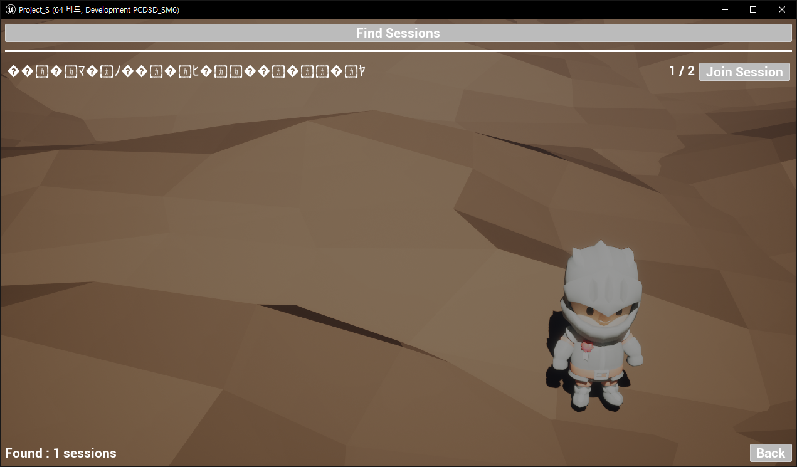
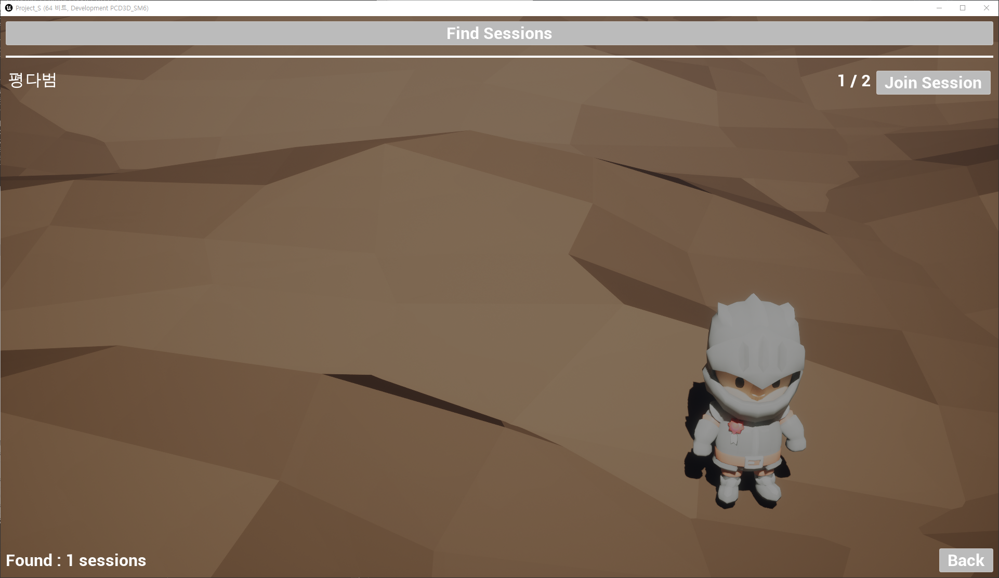

# The First Foreigner    
<p align="center">
  >
	
	
	
</p>

## 🎮 게임 플레이
- **직접 플레이**   
   [Steam](https://store.steampowered.com/app/3634090/The_First_Foreigner/)에서 게임 다운로드 후 실행
- **플레이 영상**   
   [YouTube](https://www.youtube.com/watch?v=AIy8zwr5r8M)에서 플레이 영상을 시청할 수 있습니다.

## 📌 프로젝트 소개
- **프로젝트 개요**   
  Unreal Engine으로 제작한 3D 멀티플레이 캐주얼 게임\
  두 명의 플레이어가 번갈아 제시어를 행동이나 사물로 표현하고, 상대가 이를 추리해 맞추는 방식
- **개발 기간**   
  2024.09.10 ~ 2024.12.06 : 리슨 서버 기반 빌드 개발 완료\
  2025.05.17 ~ 2025.06.09 : Online Subsystem 기반 리팩토링 및 Steam 게시 완료
- **개발 상태**   
  Steam 게시 완료 (개발 종료)
- **개발 환경**   
  Unreal 5.2.1\
  Windows 10 (64bit)
- **멤버 구성**   
  기획 및 레벨 디자인 1명\
  프로그래밍 1명

## 🎯 담당 업무
- Unreal Gameplay Framework 기반 **게임 플레이 로직** 구현   
- Replication·RPC 기반 클라이언트–서버 **데이터 동기화 및 명령 처리**   
- Animation Blueprint·AnimInstance·State Machine 기반 캐릭터 **애니메이션 제어**   
- Widget Blueprint 기반 **동적 UI** 제작 및 **데이터 연동**   
- Online Subsystem 기반 **세션 관리** 및 **Steam 게시**

## 🛠 이슈 및 해결 과정
### 캐릭터 시선 Rotator 불일치
- **문제**   
  호스트 캐릭터는 시선 Rotator에 따라 정상적으로 회전\
  하지만 로컬 캐릭터는 시선 Rotator가 적용되지 않고 초기값으로 되돌아가는 현상이 발생   
  <div align="center">
	   
  </div>
  
- **원인**   
  AnimInstance::NativeUpdateAnimation()에서 캐릭터 시선의 Rotator를 직접 계산하고 Bone을 회전한 것이 문제\
  AnimInstance 멤버 변수는 동기화 되지 않으므로 로컬에서 변경된 시선 Rotator가 다른 로컬에 전파되지 않음
	<details>
		<summary> <em>코드 펼치기/접기</em></summary>
		
	```C++
	// Before
	void UPS_AnimInstance::NativeUpdateAnimation(float DeltaSeconds)
	{
	  ︙
		// AnimInstance에서 ControlRotation을 직접 계산
		ControlRotation.Roll = -Character->GetControlRotation().Pitch + 90.0f;
		if (ControlRotation.Roll < 0)
		{
		  ControlRotation.Roll += 360.0f;
		}
		ControlRotation.Roll = FMath::Clamp(ControlRotation.Roll, 90 - MAX_ROTATION_ROLL, 90 - MIN_ROTATION_ROLL);
		ControlRotation.Yaw = Character->GetControlRotation().Yaw - 90.0f - Character->GetActorRotation().Yaw;
	  ︙
	}
	```
	</details>

- **해결**   
  로컬 캐릭터의 시선 Rotator가 변경되면 RPC를 통해 서버에 전달하고, 서버가 NetMulticast로 모든 클라이언트에 전파하도록 구조를 변경
	<details>
		<summary> <em>코드 펼치기/접기</em></summary>
		
	```C++
	// After
	void APS_Character::SetHeadRotator(FRotator NewRotator)
	{
	  // 로컬에서 서버로 RPC 요청
		SetHeadRotator_Server(NewRotator);
	}
	
	UFUNCTION(Server, Reliable)
	void SetHeadRotator_Server(FRotator NewRotator);
	
	void APS_Character::SetHeadRotator_Server_Implementation(FRotator NewRotator)
	{
	  // 서버에서 모든 클라이언트로 전파
		SetHeadRotator_Client(NewRotator);
	}
	
	UFUNCTION(NetMulticast, Reliable)
	void SetHeadRotator_Client(FRotator NewRotator);
	
	void APS_Character::SetHeadRotator_Client_Implementation(FRotator NewRotator)
	{
		PS_AnimInstance->SetControlRotation(NewRotator);
	}
	```
	</details>

- **결과**   
  캐릭터의 시선 Rotator가 호스트와 모든 로컬 클라이언트에서 동일하게 동기화되어 자연스러운 시선 처리를 연출   
  <div align="center">
	
  </div>
	
### 클라이언트 세션이 초기화되지 않는 현상
- **문제**   
  호스트가 세션을 종료하면, 클라이언트의 세션이 정상적으로 종료되지 않아 존재하지 않는 세션에 접근하는 문제 발생\
  이로 인해 클라이언트는 Find Session 목록을 갱신하지 못하고, 강제로 Host Game을 실행해야만 정상적으로 출력됨   
  <div align="center">
	   
  </div>
  
- **원인**   
  호스트가 클라이언트보다 먼저 세션을 종료해 클라이언트에서는 이미 없는 세션을 참조하는 상태가 됨
	<details>
		<summary> <em>코드 펼치기/접기</em></summary>
		
	```C++
	// Before
	void UPS_GameInstance::OnEndSessionComplete(FName SessionName, bool bWasSuccessful)
	{
	  ︙
		// 클라이언트 세션 종료 없이 호스트가 먼저 세션을 종료
		SessionInterface->DestroySession(CurrentSessionName);
	  ︙
	}
	```
	</details>

- **해결**   
  호스트가 세션을 종료하기 전에 모든 클라이언트를 순회하며 RPC를 통해 세션 종료를 요청하도록 변경\
  각 클라이언트는 GameInstance::LeaveSession()을 호출해 스스로 세션을 종료
	<details>
		<summary> <em>코드 펼치기/접기</em></summary>
		
	```C++
	// After
	void UPS_GameInstance::OnEndSessionComplete(FName SessionName, bool bWasSuccessful)
	{
	  ︙
		// 호스트 종료 전 모든 클라이언트에게 세션 종료 요청
		for (FConstPlayerControllerIterator It = World->GetPlayerControllerIterator(); It; ++It)
		{
			APS_PlayerController* PC = Cast<APS_PlayerController>(It->Get());
			if (PC && !PC->IsLocalController())
			{
				PC->Client_OnHostEndSession();
			}
		}

		// 호스트 세션 종료
		SessionInterface->DestroySession(CurrentSessionName);
	  ︙
	}
	
	UFUNCTION(Client, Reliable)
	void Client_OnHostEndSession();
	
	void APS_PlayerController::Client_OnHostEndSession_Implementation()
	{
		if (UPS_GameInstance* PS_GameInstance = Cast<UPS_GameInstance>(GetGameInstance()))
		{
			// 클라이언트 세션 종료
			PS_GameInstance->LeaveSession();
		}
	}
	```
	</details>

- **결과**   
  모든 클라이언트의 세션이 항상 정상적으로 종료되어 Find Session 목록이 정상적으로 출력됨   
  <div align="center">
	   
  </div>

### Steam 닉네임이 비정상적으로 출력
- **문제**   
  Find Session 결과에서 유저의 Steam 닉네임이 깨져 정상적인 구분이 불가능   
  <div align="center">
	   
  </div>
  
- **원인**   
  Steam 닉네임은 한글 등 비-ASCII 문자를 포함할 수 있음\
  Unreal Engine은 닉네임을 UTF-16 기반 FString으로 받아오지만, Online Subsystem의 메타데이터 전송 구간은 ASCII를 전제로 직렬화\
  이 과정에서 UTF-16 → ASCII으로의 변환 손실이 발생하여 닉네임이 깨짐
	<details>
		<summary> <em>코드 펼치기/접기</em></summary>
		
	```C++
	// Before
	void UPS_GameInstance::CreateSession(bool bMakePrivate, const FString& InPassword)
	{
	  ︙
		// 호스트의 닉네임을 FString으로 받아옴
		HostNick = Identity->GetPlayerNickname(*UserId);
	
		// FString을 변환 없이 그대로 SessionSettings에 저장
		SessionSettings->Set(FName("HostName"), HostNick, EOnlineDataAdvertisementType::ViaOnlineServiceAndPing);
	  ︙
	}
	```
	</details>

- **해결**   
  세션 생성시 호스트의 Steam 닉네임을 UTF-8 → Base64 인코딩해 전송\
  클라이언트는 Base64 → UTF-8 → FString 디코딩 과정을 거쳐 깨지지 않은 문자열을 복원
	<details>
		<summary> <em>코드 펼치기/접기</em></summary>
		
	```C++
	// After
	void UPS_GameInstance::CreateSession(bool bMakePrivate, const FString& InPassword)
	{
	  ︙
		// FString을 UTF-8로 변환
		FTCHARToUTF8 Utf8Host(*HostNick);
		
		// UTF-8을 Base64로 변환
		FString EncHost = FBase64::Encode(reinterpret_cast<const uint8*>(Utf8Host.Get()), (uint32)Utf8Host.Length());
		
		// SessionSettings에 저장
		SessionSettings->Set(FName("HostNameB64"), EncHost, EOnlineDataAdvertisementType::ViaOnlineService);
	  ︙
	}
	
	void UPS_GameInstance::OnFindSessionsComplete(bool bWasSuccessful)
	{
	  ︙
		// SessionSettings에서 문자열을 꺼냄
		FString EncHost;
		Settings.Get(FName("HostNameB64"), EncHost);
	
		// Base64를 UTF-8로 변환
		TArray<uint8> HostBytes;
		if (FBase64::Decode(EncHost, HostBytes))
			HostBytes.Add(0);
	
		// UTF-8을 FString으로 변환
		FString DecodedHost = UTF8_TO_TCHAR(reinterpret_cast<const char*>(HostBytes.GetData()));
	  ︙
	}
	```
	</details>

- **결과**   
  ASCII 외 문자를 포함한 Steam 닉네임도 깨지지 않고 정상적으로 출력   
  <div align="center">
	   
  </div>

## 프로젝트 구조
```plaintext
Source/
├── Project_S/
│   ├── Project_S.h
│   ├── Project_S.cpp                       # 커스텀 로그 카테고리 선언
│   ├── PS_AnimInstance.h
│   ├── PS_AnimInstance.cpp                 # 폰의 상태에 대해 폰의 Transform 및 애님 블루프린트를 제어
│   ├── PS_BaseGrabUp.h
│   ├── PS_BaseGrabUp.cpp                   # 월드에 배치할 수 있는 액터로, 폰이 Grab하면 폰의 시선 방향에 액터가 고정됨
│   ├── PS_BasePickup.h
│   ├── PS_BasePickup.cpp                   # (미사용) 월드에 배치할 수 있는 액터로, 폰이 overlap하면 폰의 손에 무기로 장착됨
│   ├── PS_Character.h
│   ├── PS_Character.cpp                    # 유저가 직접 조종하는 폰으로, 키 바인딩과 같이 유저의 특정 행동에 대해 폰을 제어
│   ├── PS_Enemy.h
│   ├── PS_Enemy.cpp                        # (미사용) AI에 의해 월드를 돌아다니는 폰으로, 유저를 발견하면 추적함
│   ├── PS_GameInstance.h
│   ├── PS_GameInstance.cpp                 # Online Subsystem을 이용해 게임 호스트, 게임 참가를 구현
│   ├── PS_GameMode.h
│   ├── PS_GameMode.cpp                     # 게임의 규칙을 선언하고 게임의 흐름을 제어
│   ├── PS_GameState.h
│   ├── PS_GameState.cpp                    # 게임의 현재 상태를 저장하고 서버와 클라이언트 간에 상태를 동기화
│   ├── PS_Grabable.h                       # PS_BaseGrabUp 클래스의 인터페이스
│   ├── PS_HUD.h
│   ├── PS_HUD.cpp                          # UI와 GameState 간의 상태를 동기화하고 PlayerController의 행동에 대해 UI를 제어
│   ├── PS_Interactable.h                   # (미사용) BP_Interactable 클래스의 인터페이스
│   ├── PS_MainMenuPawn.h
│   ├── PS_MainMenuPawn.cpp                 # 메인 메뉴에 사용하는 폰
│   ├── PS_PlayerController.h
│   ├── PS_PlayerController.cpp             # 유저의 입력을 처리하고 UI와 Session을 관리
│   ├── PS_PlayerState.h
│   ├── PS_PlayerState.cpp                  # 클라이언트의 상태(SelectedWord)를 저장하고 서버와 클라이언트 간에 상태를 동기화
│   ├── PS_TimeUtility.h
│   ├── PS_TimeUtility.cpp                  # 블루프린트의 커스텀 노드를 선언 및 정의
└── └── PS_Words.h                          # DataTable의 Row를 커스텀으로 정의하기 위한 구조체
Content/
├── Blueprints/
│   ├── Grabup/
│   │   ├── BP_Grabup.uasset            # PS_BaseGrabUp을 상속 받는 Base 애셋
│   │   ├── BP_Grabup_*.uasset          # BP_Grabup을 상속 받아 구현한 애셋들
│   ├── Pickup/
│   │   ├── BP_Pickup_Weapon.uasset     # (미사용) PS_BasePickup을 상속 받는 Base 애셋
│   │   ├── BP_Pickup_*.uasset          # (미사용) BP_Pickup_Weapon을 상속 받아 구현한 애셋들
│   ├── UI/
│   │   ├── MainMenu/
│   │   │   ├── WB_MainMenu_*.uasset    # 메인 메뉴에서 사용하는 UI들
│   │   ├── Session/
│   │   │   ├── WB_Session_*.uasset     # 세션 메뉴에서 사용하는 UI들
│   ├── WB_*_HUD.uasset                 # 게임 내에서 사용하는 UI들
├── Inputs/
│   ├── IA_*.uasset                     # 각 Action에 대한 값과 트리거를 설정
└── └── IMC_Default.uasset              # InputAction과 키를 매핑
```
