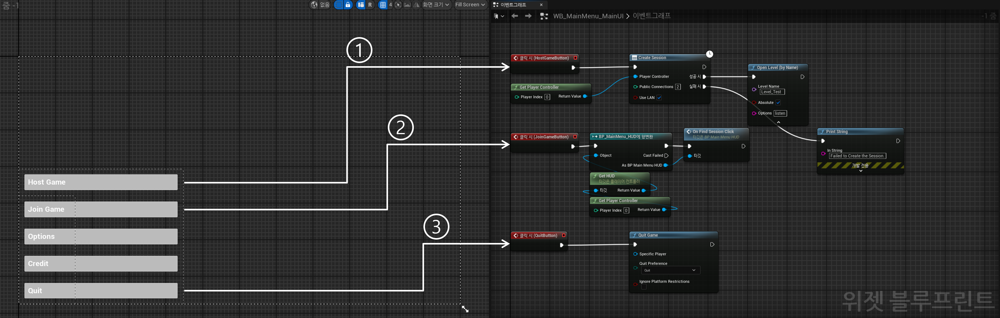
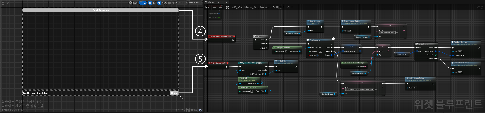
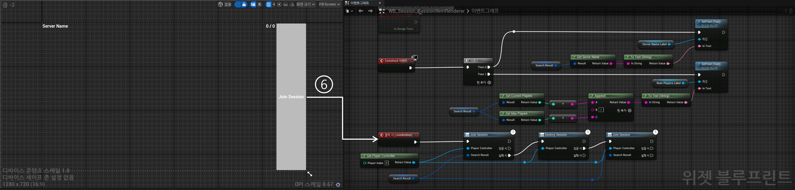
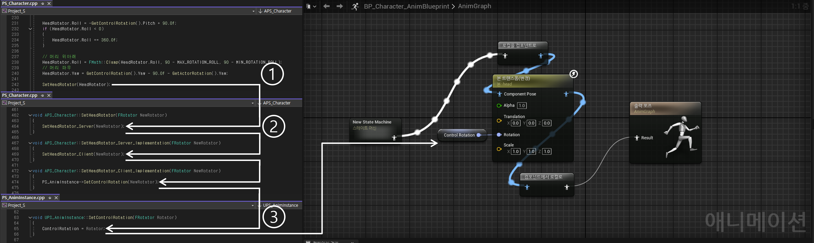
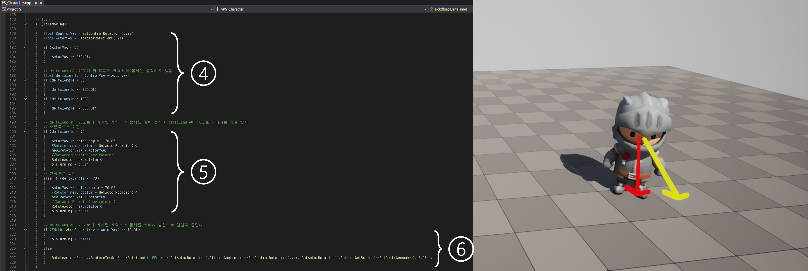
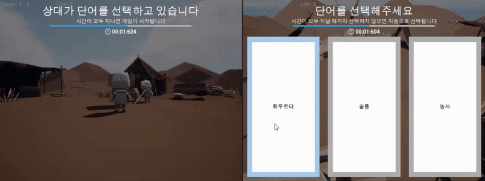
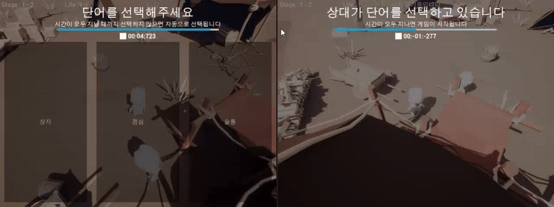

# Squire

## 데모

- **플레이 방법**
  - [Steam](https://store.steampowered.com/app/3634090/The_First_Foreigner/)에서 게임을 다운로드 받고, 실행합니다.   
- **YouTube 링크**   
  [](https://www.youtube.com/watch?v=AIy8zwr5r8M)

---

<br>

## 프로젝트 소개
- **개발 기간**   
  2024.09.10 ~ 2024.12.06 (2025.05.19 Steam 업로드 완료)
- **개발 환경**   
  Unreal 5.2.1   
  Windows 10 (64bit)
- **설명**   
  Unreal Engine 5를 활용하여 제작한 리슨 서버 기반의 3D 멀티플레이 게임.   
- **프로젝트 목적**
  Unreal Engine 5 프레임워크를 이해하고, 네트워크 프로그래밍을 적용해 클라이언트-서버 구조의 게임을 개발한다.   
  제작된 게임은 패키징 및 배포 과정을 거쳐 실제 서비스로 제공하며, 유저들에게 피드백을 받아 게임을 개선하는 경험도 포함한다.
- **멤버 구성**
  - 기획 및 레벨 디자인 1명   
  - 프로그래밍 1명   
- **담당 업무**
  - Replication 및 RPC를 통해 클라이언트-서버 간 데이터 동기화 및 명령 전파를 구현   
  - Animation Blueprint, Montage, AnimNotify를 사용하여 애니메이션 전환을 제어   
  - Interface 및 Actor Component를 활용하여 유연하고 재사용 가능한 시스템을 설계   
  - Widget Blueprint를 활용하여 게임 로직과 연동된 동적 UI 시스템을 구현   
  - Steamworks API를 활용하여 Steam과 연동 및 게임 매칭 시스템 구현   
- **주요 기술 및 도구**   
  - **Framework**   
    - Unreal (C++, Blueprint)   
    - Steamworks   
  - **Network**   
    - Replication, RPC, OnlineSubsystem   
  - **UI**   
    - UMG

<br>

---

<br>

## 프로젝트 구조
```plaintext
Source/
├── Project_S/
│   ├── Project_S.h
│   ├── Project_S.cpp                       # 커스텀 로그 카테고리 선언
│   ├── PS_AnimInstance.h
│   ├── PS_AnimInstance.cpp                 # 폰의 상태에 대해 폰의 Transform 및 애님 블루프린트를 제어
│   ├── PS_BaseGrabUp.h
│   ├── PS_BaseGrabUp.cpp                   # 월드에 배치할 수 있는 액터로, 폰이 Grab하면 폰의 시선 방향에 액터가 고정됨
│   ├── PS_BasePickup.h
│   ├── PS_BasePickup.cpp                   # (미사용) 월드에 배치할 수 있는 액터로, 폰이 overlap하면 폰의 손에 무기로 장착됨
│   ├── PS_Character.h
│   ├── PS_Character.cpp                    # 유저가 직접 조종하는 폰으로, 키 바인딩과 같이 유저의 특정 행동에 대해 폰을 제어
│   ├── PS_Enemy.h
│   ├── PS_Enemy.cpp                        # (미사용) AI에 의해 월드를 돌아다니는 폰으로, 유저를 발견하면 추적함
│   ├── PS_GameInstance.h
│   ├── PS_GameInstance.cpp                 # Steamworks API를 이용해 게임 호스트, 게임 참가를 구현
│   ├── PS_GameMode.h
│   ├── PS_GameMode.cpp                     # 게임의 규칙을 선언하고 게임의 흐름을 제어
│   ├── PS_GameState.h
│   ├── PS_GameState.cpp                    # 게임의 현재 상태를 저장하고 서버와 클라이언트 간에 상태를 동기화
│   ├── PS_Grabable.h                       # PS_BaseGrabUp 클래스의 인터페이스
│   ├── PS_HUD.h
│   ├── PS_HUD.cpp                          # UI와 GameState 간의 상태를 동기화하고 PlayerController의 행동에 대해 UI를 제어
│   ├── PS_Interactable.h                   # (미사용) BP_Interactable 클래스의 인터페이스
│   ├── PS_MainMenuPawn.h
│   ├── PS_MainMenuPawn.cpp                 # 메인 메뉴에 사용하는 폰
│   ├── PS_PlayerController.h
│   ├── PS_PlayerController.cpp             # 유저의 입력을 처리하고 UI와 Session을 관리
│   ├── PS_PlayerState.h
│   ├── PS_PlayerState.cpp                  # 클라이언트의 상태(SelectedWord)를 저장하고 서버와 클라이언트 간에 상태를 동기화
│   ├── PS_TimeUtility.h
│   ├── PS_TimeUtility.cpp                  # 블루프린트의 커스텀 노드를 선언 및 정의
└── └── PS_Words.h                          # DataTable의 Row를 커스텀으로 정의하기 위한 구조체
Content/
├── Blueprints/
│   ├── Grabup/
│   │   ├── BP_Grabup.uasset            # PS_BaseGrabUp을 상속 받는 Base 애셋
│   │   ├── BP_Grabup_*.uasset          # BP_Grabup을 상속 받아 구현한 애셋들
│   ├── Pickup/
│   │   ├── BP_Pickup_Weapon.uasset     # (미사용) PS_BasePickup을 상속 받는 Base 애셋
│   │   ├── BP_Pickup_*.uasset          # (미사용) BP_Pickup_Weapon을 상속 받아 구현한 애셋들
│   ├── UI/
│   │   ├── MainMenu/
│   │   │   ├── WB_MainMenu_*.uasset    # 메인 메뉴에서 사용하는 UI들
│   │   ├── Session/
│   │   │   ├── WB_Session_*.uasset     # 세션 메뉴에서 사용하는 UI들
│   ├── WB_*_HUD.uasset                 # 게임 내에서 사용하는 UI들
├── Inputs/
│   ├── IA_*.uasset                     # 각 Action에 대한 값과 트리거를 설정
└── └── IMC_Default.uasset              # InputAction과 키를 매핑
```
                              
<br>

---

<br>

## 주요 기능 및 구조도
### 1. 게임 Session 생성 및 참가   
  
- **설명**:   
  Host가 Host Game 버튼을 눌러 게임 Session을 생성하고, 다른 유저는 Find Session 버튼을 눌러 생성된 게임 Session을 검색한다. 참가하고자 하는 Sesison에 Join Session 버튼을 눌러 참가할 수 있다.
- **주요 기술**:   
  UMG와 블루프린트를 이용한 MainMenu UI와 Session UI 제작
  Steamworks API를 활용한 게임 호스트 및 참가
- **구조도**:   
  
  ① Host Game 버튼을 누르면 GameInstance는 Steamworks API를 이용해 Session을 생성한다.
  ② Join Game 버튼을 누르면 Find_Session_UI를 화면에 출력한다.   
  ③ Quit 버튼을 누르면 게임을 종료한다.   
     
  ④ Find Session 버튼을 누르면 Session Scroll Box의 모든 요소들을 지우고, LAN 상에서 Session을 최대 10개 검색해 화면에 출력한다.   
  ⑤ Back 버튼을 누르면 Main_Menu_UI를 화면에 출력한다.   
     
  ⑥ Join 버튼을 누르면 Session에 참가한다. 만약 참가에 실패하면, 기존의 Session을 지우고 다시 시도한다.   

### 2. 캐릭터 시선 처리  
  
- **설명**:   
  마우스로 캐릭터의 시선을 조종할 수 있다. 이때 일정 각도 이상으로 캐릭터의 고개가 회전하면 몸통이 따라 움직이게 된다. 또한 카메라와 캐릭터 사이의 거리가 일정 이하로 가까워지면 캐릭터의 투명도가 증가해 시야를 넓힌다.
- **주요 기술**:   
  RPC를 활용한 캐릭터의 Rotator 동기화
- **구조도**:
  
  ① PS_Character.cpp의 Look() 메서드에서 ControlRotation를 이용해 HeadRotator 변수를 초기화한다. 이때 캐릭터의 머리가 과도하게 꺾이지 않도록 각도에 제한을 두었다.   
  ② PS_Character.cpp의 SetHeadRotator() 메서드에서 RPC을 통해 모든 클라이언트의 PS_AnimInstance에게 HeadRotator 변수의 값을 전달한다. RPC를 사용했기 때문에 모든 클라이언트에게 동일한 값이 전달된다.   
  ③ 모든 클라이언트의 PS_AnimInstance.cpp의 SetControlRotation() 메서드에서 전달받은 인자의 값을 이용해 Head 본의 Rotation을 바꾼다. 이를 통해 캐릭터의 고개가 항상 카메라가 바라보는 방향과 일치하게 된다.   
  
  ④ PS_Character.cpp의 Tick() 메서드에서 캐릭터의 몸통 Rotation(빨간색 화살표) 값과 캐릭터의 고개 Rotation(노란색 화살표) 값의 차이를 계산한다.   
  ⑤ 몸통 Rotation 값과 캐릭터의 고개 Rotation 값이 일정한 각도보다 커지게 되면 캐릭터의 몸통을 캐릭터의 고개가 바라보는 방향으로 회전시킨다.
  
  ⑦ BP_Character 블루프린트의 틱 이벤트 노드에서 카메라와 캐릭터 사이의 거리를 계산한다. 이때 거리가 일정 이하로 가까워지면 Local에서 컨트롤 되는 Character의 DitherAlpha 값을 카메라와 캐릭터 사이의 거리를 선형 변환한 값으로 바꾼다. 이때 DitherAlpha는 캐릭터의 Material에서 투명도를 조절하는 값이다.

### 3. 게임 흐름 제어와 데이터 동기화   
  
- **설명**:   
  한 유저가 단어를 선택하면 선택한 단어를 기억한다. 그리고 일정 시간 이후 다른 유저가 제시어를 유추하는데, 이때 선택한 단어와 유추한 단어가 일치하면 정답으로 판정하고 다음 스테이지를 진행한다. 일치하지 않으면 오답으로 판정하고 Life를 차감한다. 이 과정에서 유저 간 데이터가 동기화 되어야 한다.
- **주요 기술**:   
  GameMode를 통한 게임 흐름 제어, 변수 Replication을 통한 데이터 동기화
- **구조도**:
  
  ① PS_GameMode.cpp에서 상황에 따라 각 PlayerController에 맞는 UI를 출력하도록 요청한다. 이때 RPC를 활용해 PlayerController에 UI를 정확히 출력하도록 했고, 타이머의 남은 시간이 정확하게 전달될 수 있도록 했다.   
  ② 플레이어가 제시어를 선택하기 전, PS_GameMode.cpp에서 제시어를 저장하고 있는 변수인 SelectedWord를 초기화하도록 요청한다. 이때 RPC를 활용해 모든 클라이언트가 동일한 SelectedWord 변수에 대해 초기화를 진행하고 동기화하도록 했다.
<br>

---

<br>

## 이슈 및 해결 과정
### 0. 기획 변경
- **문제**:   
  [최초 기획서](docs/24.09.01_최초_기획서.pdf)   
  최초에 작성 되었던 기획서를 바탕으로 개발을 한 지 한달 반 정도 지났을 무렵, 멘토로부터 해당 프로젝트의 기획을 변경했으면 좋겠다는 요청을 받았다.
- **원인**:   
  이 프로젝트는 3개월의 개발 시간을 목표로 시작한 프로젝트였다. 하지만 최초 기획서에서 기획한 게임이 3개월 내에 개발할 볼륨의 게임이 아니라 1년 혹은 그 이상의 개발 기간을 필요로 할 것이라는 우려가 있었다.
- **해결**:  
  [수정한 기획서](docs/2차_기획서.pdf)   
  이후 팀원과 상의하여 지금까지 개발한 기능의 일부를 폐기하더라도 기획을 틀어 지금의 캐주얼 게임을 개발하게 되었다. 결국 1개월이라는 짧은 시간 안에 해당 게임을 개발했고, 시간이 더 많았더라면 더 많은 기능을 구현했을 것이라는 아쉬움이 남아 있다.
### 1. 캐릭터의 시선 처리   
     
  (좌 : 서버, 우 : 클라이언트)
- **문제**:   
  마우스로 캐릭터의 시선을 움직이는 기능을 구현하고, 캐릭터의 몸통 또한 시선을 따라가는 기능을 구현하는 도중 클라이언트 측 플레이어의 화면에서 다른 플레이어의 회전이 비정상적으로 출력됐다.
- **원인**:   
  PS_Character.cpp의 코드에서 단순히 SetActorRotation 메서드를 사용한 것이 문제였다. 로컬 변수의 값이 변경되었을 때, 서버는 클라이언트에게 레플리케이션을 통해 값이 변경되었음을 알릴 수 있다. 하지만 클라이언트는 서버에게 RPC를 사용하지 않으면 값이 변경되었음을 알릴 수 없다. 따라서 클라이언트의 Rotation이 변경되었음에도 다른 클라이언트들은 값이 변경되지 않았다고 판단해 계속 원래의 값으로 돌아가 이러한 문제가 발생한 것이다.
  ```c++
  PS_Character.cpp
  void APS_Character::Look(const FInputActionValue& Value)
  {
  ...
    // delta_angle이 70도보다 커지면 캐릭터의 몸체도 같이 움직여 delta_angle이 70도보다 커지는 것을 방지
    // 오른쪽으로 회전
    if (delta_angle > 70)
    {
      ActorYaw += delta_angle - 70.0f;
      FRotator new_rotator = GetActorRotation();
      new_rotator.Yaw = ActorYaw;
      SetActorRotation(new_rotator);
    }
    // 왼쪽으로 회전
    else if (delta_angle < -70)
    {
      ActorYaw += delta_angle + 70.0f;
      FRotator new_rotator = GetActorRotation();
      new_rotator.Yaw = ActorYaw;
      SetActorRotation(new_rotator);
    }
  ...
  }
  ```
- **해결**:   
  클라이언트 플레이어의 Rotation 값이 변경되면 변경된 Rotation 값을 인자로 RPC를 요청하도록 수정했다. 이때 서버는 접속한 모든 클라이언트에게 변경된 Rotation 값으로 SetActorRotation 메서드를 호출하도록 해 모든 플레이어의 회전이 정상적으로 출력된다.
  ```c++
  PS_Character.cpp
  void APS_Character::Look(const FInputActionValue& Value)
  {
  ...
    // delta_angle이 70도보다 커지면 캐릭터의 몸체도 같이 움직여 delta_angle이 70도보다 커지는 것을 방지
    // 오른쪽으로 회전
    if (delta_angle > 70)
    {
      ActorYaw += delta_angle - 70.0f;
      FRotator new_rotator = GetActorRotation();
      new_rotator.Yaw = ActorYaw;
      RotateActor(new_rotator);
      bIsTurning = true;
    }
    // 왼쪽으로 회전
    else if (delta_angle < -70)
    {
      ActorYaw += delta_angle + 70.0f;
      FRotator new_rotator = GetActorRotation();
      new_rotator.Yaw = ActorYaw;
      RotateActor(new_rotator);
      bIsTurning = true;
    }
    // delta_angle이 70도보다 커지면 캐릭터의 몸체를 카메라 방향으로 천천히 돌린다
    if (FMath::Abs(ControlYaw - ActorYaw) <= 10.0f)
    {
      bIsTurning = false;
    }
    else
    {
      RotateActor(FMath::RInterpTo(GetActorRotation(), FRotator(GetActorRotation().Pitch, Controller->GetControlRotation().Yaw, GetActorRotation().Roll), GetWorld()->GetDeltaSeconds(), 5.0f));
    }
  ...
  }
    
  void APS_Character::RotateActor(FRotator NewRotator)
  {
     RotateActor_Server(NewRotator);
  }
  void APS_Character::RotateActor_Server_Implementation(FRotator NewRotator)
  {
     RotateActor_Client(NewRotator);
  }
  void APS_Character::RotateActor_Client_Implementation(FRotator NewRotator)
  {
     SetActorRotation(NewRotator);
  }
  ```

### 2. 타이머의 남은 시간 동기화
     
  (좌 : 서버, 우 : 클라이언트)
- **문제**:   
  서버 플레이어는 타이머의 남은 시간이 정상적으로 출력되지만, 클라이언트 플레이어는 타이머의 남은 시간이 비정상적으로 출력됐다.
- **원인**:   
  타이머를 ms 단위까지 표시하기 위해 int32가 아닌 FTimerHandle을 사용한 것이 문제였다. 타이머 UI의 남은 시간을 새로 설정할 때마다 GameMode.cpp에서 GetWorldTimerManager().SetTimer 메서드를 이용해 FTimerHandle를 초기화했다. 그리고 초기화한 FTimerHandle을 PlayerController가 HUD에 전달해 모든 클라이언트에 타이머를 출력하고자 했다. 하지만 GameMode는 서버에만 존재하므로 클라이언트에서 접근할 수 없었고, 따라서 클라이언트의 FTimerHandle은 값이 항상 null이었다.
  ```c++
  PS_GameMode.cpp
  void APS_GameMode::StartGameAfter5Seconds()
  {
      // 타이머 설정
      GetWorldTimerManager().SetTimer(StartGameTimerHandle, this, &APS_GameMode::OnStartGameAfter5SecondsComplete, GameStartWaitTime, false);
  
      // 모든 Player의 Stage UI 수정
      for (FConstPlayerControllerIterator It = GetWorld()->GetPlayerControllerIterator(); It; It++)
      {
          APS_PlayerController* PS_PlayerController = Cast<APS_PlayerController>(It->Get());
          if (PS_PlayerController)
          {
              PS_PlayerController->ReadyStartGame(StartGameTimerHandle);
          }
      }
  }
  ```

  ```c++
  PS_PlayerController.cpp
  void APS_PlayerController::ReadyStartGame_Implementation(FTimerHandle TimerHandle)
  {
      APS_HUD* PS_HUD = Cast<APS_HUD>(GetHUD());
      if (PS_HUD)
      {
          PS_HUD->SetStageTimer(TimerHandle);
          PS_HUD->ShowTimer();
      }
  }
  ```

- **해결**:   
  GameMode에서 PlayerController에게 FTimerHandle를 전달하지 않고, 남은 시간을 계산한 float 값을 전달하도록 수정했다. GameMode는 서버에 존재하므로 모든 PlayerController에게 float 값을 복사해 전달할 수 있었다.
  ```c++
  PS_GameMode.cpp
  void APS_GameMode::StartGameAfter5Seconds()
  {
      // 타이머 설정
      GetWorldTimerManager().SetTimer(StartGameTimerHandle, this, &APS_GameMode::OnStartGameAfter5SecondsComplete, GameStartWaitTime, false);
  
      // 모든 Player의 Stage UI 수정
      for (FConstPlayerControllerIterator It = GetWorld()->GetPlayerControllerIterator(); It; It++)
      {
          APS_PlayerController* PS_PlayerController = Cast<APS_PlayerController>(It->Get());
          if (PS_PlayerController)
          {
              PS_PlayerController->ReadyStartGame(GetWorld()->GetTimerManager().GetTimerRemaining(StartGameTimerHandle));
          }
      }
  }
  ```

  ```c++
  PS_PlayerController.cpp
  void APS_PlayerController::ReadyStartGame_Implementation(float RemainingTime)
  {
      APS_HUD* PS_HUD = Cast<APS_HUD>(GetHUD());
      if (PS_HUD)
      {
          PS_HUD->SetStageTimer(RemainingTime);
          PS_HUD->ShowTimer();
      }
  }
  ```
- **예상되는 문제**:   
  위의 해결 방안은 레이턴시나 패킷 손실을 고려하지 않은 코드이다. 따라서 서버에서 출력되는 남은 시간과 클라이언트에서 출력되는 남은 시간이 서로 일치하지 않을 가능성이 여전히 남아 있다. 추후 예상되는 문제를 모두 해결한 코드로 수정해야 할 것이다.


<br>

---

<br>

## 프로젝트를 마치며...
  현재 서비스 되고 있는 게임의 절반 이상이 네트워크 기반의 멀티플레이 게임이라고 생각한다. 따라서 네트워크 기반의 게임 개발 역량이 필요한 것은 명백했다. 지금까지 이러한 게임의 개발을 경험해 본 적은 없었지만, 조금 욕심을 내어 이러한 프로젝트에 도전해보고 싶었다.   
  
  처음은 무난하게 시작했다고 생각했다. 하지만 서적이나 구글링을 통해서도 쉽게 알아내지 못하는 내용들이 계속 튀어나왔고, 기획마저 엎어지니 내가 이 프로젝트를 시간 안에 개발 완료할 수 있을지 두려웠다. 괜히 무리해서 생소한 분야로의 프로그래밍을 추진했나 싶기도 했다. 그래도 팀원을 생각하며 꾸역꾸역 개발을 이어나갔고, 결과적으로 만족스럽지는 않지만 나름 게임이라고 부를 만한 결과물이 나왔다.  
 
  어디가서 자랑스럽게 내보일 결과물은 아닐지라도 나름 의미 깊은 프로젝트이지 않았나 싶다. 처음 목표로 했던 네트워크 기반의 게임 개발을 충분히 경험했고, 게임 개발 이외의 영역에서 많은 것들을 경험할 수 있었다. 팀 프로젝트에서의 팀원과의 협력이나 갈등 해결, 프로젝트 관리 측면에서의 계획 수립, 목표 달성 등.. 처음 이 프로젝트를 시작해야겠다고 마음 먹은 나 자신이 너무 순진해 보일 정도로 지금의 나는 게임 개발자로서 한 걸음 더 성장한 것 같다.
